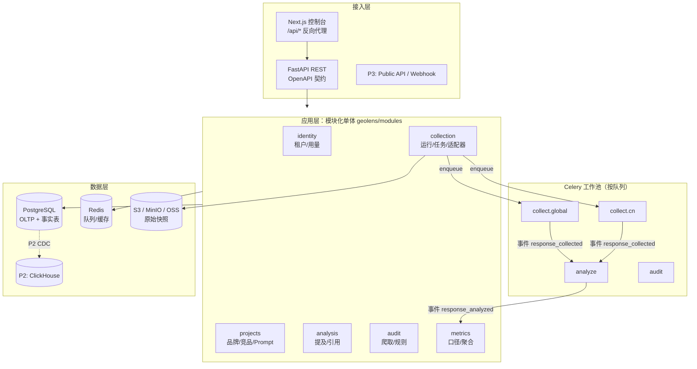
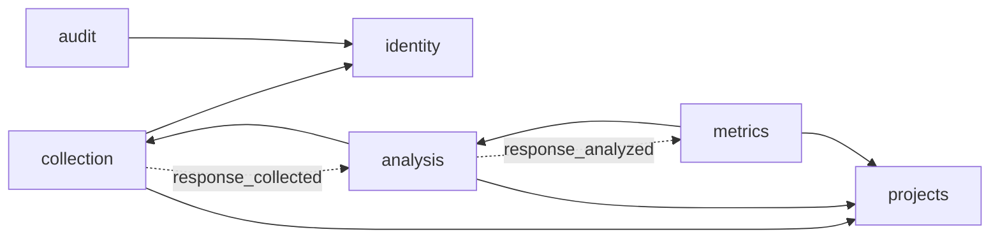
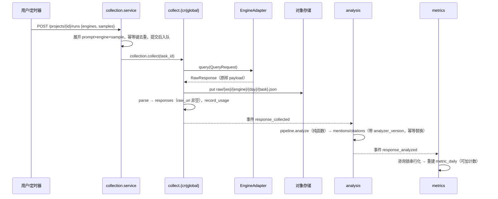

# GeoLens 架构

> 本文是架构的**唯一事实来源**。代码里的架构规则（import 合约、架构测试、CI 门禁）都从这里推导；改规则先写 ADR（`docs/adr/`），再同步本文与检查。

## 1. 定位

**GEO（Generative Engine Optimization）**关心的是品牌在 AI 生成式答案里的可见度，而不是传统 SERP 排名。GeoLens 回答两个问题：

1. **AI 怎么说我？**用户向 DeepSeek、豆包、Kimi、通义、ChatGPT、Perplexity 等提问时，AI 是否提到我、排第几、情感倾向如何、引用了谁的网页、竞品表现如何？
2. **我的网站对 AI 友好吗？**AI 爬虫能否访问、内容能否被抽取和引用、可信度信号是否完整？

演进路径：**自用工具（P1）→ 多租户 SaaS（P2）→ 开放平台（P3）**，详见 `docs/roadmap.md`。

## 2. 架构原则

| 原则 | 含义 | ADR |
|---|---|---|
| 模块化单体起步 | 一个 Python 包，按限界上下文分模块；同一份代码以 `api` / `worker` 两种进程角色运行。模块间只通过 `public.py` 和领域事件交互，拆服务时只需机械搬迁 | 0001 |
| 原始快照优先 | 每次采集的原始响应不可变地存进对象存储；解析结果都能从快照重算；事实表带 `analyzer_version` | 0003 |
| 插件化 | 引擎适配器、审计规则、分析步骤都是注册式插件，新增能力不改核心 | 0005 |
| 统计口径优先 | LLM 答案有随机性：同一 prompt 多次采样，指标为比率 + Wilson 置信区间；存可加计数，读时推导比率 | 0004 |
| 成本一等公民 | 每次付费外部调用写入 `usage_ledger`，这是未来配额与计费的数据源 | 0006 |
| 租户就绪 | 所有业务表带 `workspace_id`，查询由 Repository 统一过滤；P2 再开启 RLS | 0006 |
| 规则可执行 | 以上原则都有对应的自动检查（§8），违反即失败 | 0007 |

## 3. 总体架构



**进程角色**
- `api`：`uvicorn geolens.app.main:app`，同步处理 HTTP，把耗时工作入队
- `worker`：`celery -A geolens.app.worker worker -Q <queues>`。P1 所有队列跑在同一进程；P2 起按队列拆分部署（国内采集节点只消费 `collect.cn`）

**组合根** `geolens/app/`：唯一允许 import 所有模块的包，负责装配路由、Celery 任务、事件订阅和 ORM 元数据（`bootstrap.load_all()`）。

## 4. 限界上下文

| 模块 | 职责 | 表 | 对外（`public.py`） |
|---|---|---|---|
| `identity` | 工作区、用量计量；P2 加成员、RBAC、API Key、配额 | workspaces, usage_ledger | `record_usage`, `workspace_scope`, `ensure_default_workspace` |
| `projects` | 监测对象：项目、品牌与竞品（别名、域名）、Prompt | projects, brands, prompts | `get_snapshot` |
| `collection` | 展开运行、分发区域队列、调用适配器、存快照、发事件 | runs, query_tasks, responses | `get_response`，事件 `RESPONSE_COLLECTED` / `RUN_COMPLETED` |
| `analysis` | 答案 → 结构化事实（品牌提及位次、引用来源） | analyzed_responses, mentions, citations | `list_response_facts`，事件 `RESPONSE_ANALYZED` |
| `metrics` | 指标口径的唯一定义与聚合 | metric_daily | `get_project_metrics` |
| `audit` | 站点 GEO 审计 | audit_jobs, audit_findings | `get_audit` |

**模块依赖（只经由 public 或事件）**



**模块内分层**（import-linter `module-layers` 合约）：

```
api | tasks | public        入口：HTTP、Celery、跨模块门面
service                     用例编排（事务、事件、入队）
repository | crawler        基础设施适配（DB、网络）
models                      ORM
adapters | pipeline | rules | definitions   纯领域逻辑（不碰 DB/队列/存储）
schemas | events            DTO 与事件名
```

## 5. 核心流水线

### 5.1 AI 可见度监测



- **幂等**：`query_tasks.idempotency_key = sha256(project|prompt|engine|locale|sample|bucket)`。定时运行的 bucket 是 UTC 日期（防止重复触发），手动运行的 bucket 是 run id。任务重投时，已完成的任务直接跳过；重新分析会替换旧事实，不会重复写入。
- **失败**：单个任务失败只计入 `failed_tasks`，不影响整次运行；所有任务都结束后 run 进入 `completed`（全部失败则为 `failed`）。

### 5.2 站点 GEO 审计

`POST /audits {url}` → SSRF 校验（只允许 http(s)、只允许公网 IP、每次重定向都重新校验）→ 抓取首页、`/robots.txt`、`/llms.txt`，并用 AI 爬虫 UA 探测是否被 WAF 拦截 → 构造 `SiteContext` → 执行 `RULES` → 按严重度扣分（error −25、warn −10）。

| 规则 | 类别 | 检查内容 |
|---|---|---|
| `access.robots_ai_bots` | access | robots.txt 是否屏蔽 GPTBot、OAI-SearchBot、ClaudeBot、PerplexityBot、Google-Extended、Bytespider、Baiduspider；用 AI 爬虫 UA 访问是否被 WAF/CDN 拦截 |
| `access.llms_txt` | access | 是否提供 `/llms.txt` 且格式正确 |
| `trust.json_ld` | trust | JSON-LD 是否存在、能否解析、是否包含 Organization / WebSite |

P1 后续规则：SSR 与 CSR 内容差异（Playwright 渲染对比）、标题层级、FAQ/列表/表格结构、作者与日期、sitemap 的 lastmod、TTFB。

## 6. 插件接口

### 6.1 引擎适配器（`collection/adapters/base.py`）

```python
class EngineAdapter(Protocol):
    engine_id: str; display_name: str
    region: Literal["cn", "global"]                  # 决定队列 collect.{region}
    mode: Literal["api", "browser", "serp", "mock"]
    fidelity: Literal["ui", "api_search", "api_no_search", "synthetic"]
    async def query(self, req: QueryRequest) -> RawResponse   # 原样 payload
    def parse(self, raw: RawResponse) -> ParsedAnswer          # 文本 + 引用
```

| engine_id | 引擎 | 区域 | 方式 | 保真度 |
|---|---|---|---|---|
| `deepseek` | DeepSeek | cn | OpenAI 兼容 API | api_no_search |
| `kimi` | Kimi（Moonshot） | cn | OpenAI 兼容 API | api_no_search |
| `qwen` | 通义千问（DashScope 兼容模式） | cn | OpenAI 兼容 API | api_no_search |
| `doubao` | 豆包（火山方舟） | cn | OpenAI 兼容 API | api_no_search |
| `chatgpt` | ChatGPT（API） | global | OpenAI 兼容 API | api_no_search |
| `perplexity` | Perplexity Sonar | global | OpenAI 兼容 API（带 `search_results`） | api_search |
| `mock-cn` / `mock-global` | 确定性模拟引擎 | cn / global | mock | synthetic |

- 大部分 API 型引擎只需在 `SPECS` 里加一行 `EngineSpec`；设置了 `key_env` 对应的环境变量才会启用；模型名可以用 `GEOLENS_<ENGINE>_MODEL` 覆盖。
- **保真度**：普通 chat API 通常不联网搜索，答案和用户在产品界面看到的可能不同。报表会标注口径。P1 后续会加 SERP 型适配器（Google AI Overviews、百度 AI 搜索）和带搜索工具的 API。P2 的浏览器模式需要先做合规评估（写 ADR）。

### 6.2 审计规则（`audit/rules/base.py`）

`AuditRule.evaluate(SiteContext) -> list[Finding]`：纯函数，规则 id 以类别作前缀，每条规则都必须在契约测试里提供正例和反例。

### 6.3 分析步骤（`analysis/pipeline/`）

`analyze(AnalysisInput) -> AnalysisResult` 是纯函数。当前步骤：
- 规范化：NFKC 统一全角半角，casefold 统一大小写
- 品牌识别：品牌名加别名；ASCII 名称要求词边界，中文名称用子串匹配；按首次出现的顺序定位次
- 引用抽取：URL 规范化（去掉 www、utm 参数、fragment 和末尾斜杠）后映射到品牌域名

P1 后续：LLM 情感评判（小模型加缓存）、歧义品牌的 LLM 兜底。

## 7. 数据架构

| 存储 | 用途 | 说明 |
|---|---|---|
| PostgreSQL | 配置、运行、事实表、指标 | P1 唯一主库；事实表只追加，结构可直接迁到 ClickHouse |
| 对象存储 | 原始快照 `raw/{workspace}/{engine}/{date}/{task}.json` | 不可变；本地 `local`，生产 `s3`（MinIO/S3/OSS） |
| Redis | Celery broker/backend | P1 后续：按引擎令牌桶限流、LLM 评判缓存 |
| P2 ClickHouse | mentions/citations 时序事实 | 由演进触发器决定（§8.3） |
| P2 pgvector | 答案语义聚类 | — |

**约定**：主键用 UUID；跨模块引用只存 UUID、不建外键；时间统一 UTC；密钥 P1 放在环境变量里，P2 改为 KMS 信封加密存储。

### 7.1 指标口径（`metrics/definitions.py`）

| 指标 | 定义 |
|---|---|
| 提及率 | 提及该品牌的答案数 / 答案总数（附 Wilson 95% CI 和样本量 n） |
| 声量份额 SOV | 该品牌被提及的答案数 / Σ 所有被跟踪品牌被提及的答案数 |
| 平均位次 | 在提及该品牌的答案里，其首次出现位次的均值（1 = 第一个被提到） |
| 引用率 | 引用了该品牌域名的答案数 / 答案总数（附 CI） |
| GEO 可见度分 | 100 × (0.4·提及率 + 0.3·SOV + 0.2·(1/平均位次) + 0.1·引用率) |

`metric_daily` 按 project × brand × engine × day 存**可加计数**（n_responses、n_mentioned、n_cited、position_sum、total_brand_mentions），比率在读取时推导，所以任意时间窗口、任意引擎组合都能正确聚合。修改口径需要同时更新 golden 数据并写 ADR。

## 8. 架构治理：让长期迭代不跑偏

### 8.1 原则 → 自动检查

| 原则 | 检查 | 位置 |
|---|---|---|
| 组合根 > 模块 > core | import-linter `top-layers` | `apps/api/.importlinter` |
| 模块只经 public 交互 | import-linter `module-boundaries`（independence，忽略 `→ *.public`） | 同上 |
| 模块内分层 | import-linter `module-layers` | 同上 |
| 领域逻辑纯净 | import-linter `pure-domain`（pipeline、definitions、rules 禁止依赖 db/queue/events/storage/repository） | 同上 |
| 外部 SDK 收口、成本可计量 | `test_external_deps`：httpx、boto3、celery、openai、playwright、fastapi、sqlalchemy 各自只能出现在白名单位置 | `tests/architecture/` |
| 租户就绪 | `test_business_tables_are_tenant_scoped`；`test_repository_refuses_to_query_without_tenant_context`；集成测试 `test_workspaces_are_isolated` | `tests/architecture/`、`tests/unit/`、`tests/integration/` |
| 可拆分 | `test_no_foreign_keys_across_modules` | `tests/architecture/` |
| 原始快照优先 | `raw_uri` 非空、事实表必须有 `analyzer_version`；golden 测试从快照重算 | `tests/architecture/`、`tests/golden/` |
| 口径稳定 | 手算的 golden 指标；计数可加性测试 | `tests/golden/test_metrics_golden.py` |
| 插件契约 | 按注册表参数化的适配器契约测试（缺夹具即失败）；审计规则契约测试（缺反例即失败） | `tests/contract/` |
| 模块形状一致 | 每个模块都有 `public.py` 和 README、已在 bootstrap 注册、被 import 合约覆盖 | `test_module_structure.py` |
| API 契约 | `openapi.json` 快照测试；前端类型由它生成，CI 做一致性比对；PR 上用 oasdiff 检测破坏性变更 | `test_openapi_snapshot.py`、CI |
| 迁移无漂移 | `alembic check` | CI |
| 前端边界 | ESLint `no-restricted-imports`：features 之间不能互相引用，lib 是最底层 | `apps/web/eslint.config.mjs` |
| 改规则必须有 ADR | `scripts/check-adr.sh`：规则文件改动时，同一 PR 必须包含 `docs/adr/NNNN-*.md` | CI governance |

### 8.2 三道防线

1. **写代码时**：
   - 根目录 `CLAUDE.md` 列出硬性规则，每个模块的 README 说明该模块的职责和接口
   - `.claude/skills/` 提供配方：`new-engine-adapter`、`new-audit-rule`、`new-module`、`new-adr`
   - `make new-module` 脚手架生成标准目录
   - Claude Code 的 Stop hook：`apps/api` 有改动时自动运行 `make arch-check`，失败的输出回灌给 Claude 当场修复
   - SessionStart hook：保证云端会话里依赖齐全
2. **合并时**：
   - CI 必过项：api（lint、类型、架构合约、架构测试、迁移、全部测试）、web（生成的客户端一致、lint、类型、构建）、governance（ADR 检查、oasdiff）
   - PR 模板里有架构自检清单
   - `REVIEW.md` 列出机器查不出来的审查要点
   - `CODEOWNERS` 保护规则文件
   - 建议开启 `main` 分支保护，要求 CI 通过
3. **演进时**：
   - 修改或放宽规则先写 ADR
   - 路线图写明阶段门禁：每个阶段有"明确不做"清单和出口标准
   - 演进触发器（§8.3）
   - 每个里程碑运行 `make arch-report`（模块规模、表、依赖关系、ADR 状态、触发器状态）做复盘
   - 临时偏离登记到 `docs/tech-debt.md`

### 8.3 演进触发器

**没到阈值就不做**，防止过度设计；**到了阈值必须写 ADR 并排期**，防止拖延。

| 演进动作 | 触发条件 |
|---|---|
| 引入 ClickHouse | mentions + citations 超过 5000 万行，或看板 P95 超过 2s（`make arch-report` 会检查行数） |
| collection 拆成独立服务 / 区域采集 Agent（拉模式） | 需要国内外分离部署，或采集需要独立扩缩、独立出口 IP |
| 事件总线从 Celery 换成 Redis Streams / Kafka / NATS | 事件超过 1k/s，或需要多消费者、事件回放 |
| 开启 Postgres RLS 与成员体系 | 接入第一个外部客户 |
| 引入 Temporal | 出现跨天、需要人工介入的多步骤流程 |
| metrics 改为增量聚合 | 单项目重算超过 5s |

## 9. 部署与运行

- **本地**：`make deps`（在 Docker 里起 Postgres、Redis、MinIO）→ `make migrate` → `make api` / `make worker` / `make web` → `make demo`
- **一体化**：`make up`（docker compose 起全部服务，包含 migrate、api、worker、web）
- **P2**：K8s 部署；collect.cn 和 collect.global 的 worker 按区域部署；数据面按客户所在区域驻留（国内客户的数据落在国内）
- **可观测性**（P1 后续）：结构化日志、OpenTelemetry trace（贯穿 HTTP → 任务 → 事件链路）、Sentry；按引擎统计成功率、延迟和成本
